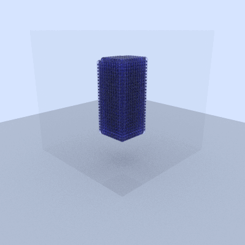

# Bubbles Renderer

Simple ray trace renderer based on ["Ray Tracing in One Weekend" tutorial series](https://raytracing.github.io/). Name comes from the fact that this renderer pretty much only supports rendering of spheres (and boxes) at the moment. Repo also contains dynamics simulations + infra to render sim results.

To build and run:
```
make

# For rendering of hard-coded scenes
./render_to_ppm > image.ppm

# Fluids sim + rendering. Use imagemagick to create gif
./fluids_sim
convert -delay 20 -loop 0 examples/images/frames/frame_*.ppm fluid_sim.gif
```

See TODOs.md for future work.



