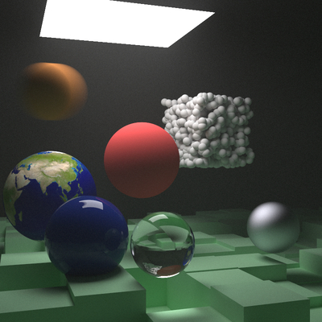

# Bubbles Renderer

Simple ray trace renderer based on ["Ray Tracing in One Weekend" tutorial series](https://raytracing.github.io/).

Most of the implementation is in headers right now, to make compilation simple. Build instructions:
```
cd examples

g++ -std=c++17 -O3 -I../src -o ppm_output ppm_output.cpp
./ppm_output > image.ppm
open image.ppm # on os x

# in one command
g++ -std=c++17 -O3 -I../src -o ppm_output ppm_output.cpp && ./ppm_output > image.ppm && open image.ppm
```

See TODOs.md for future work.


