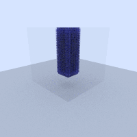

# Bubbles Renderer

Simple ray trace renderer based on ["Ray Tracing in One Weekend" tutorial series](https://raytracing.github.io/) + dynamics simulations.

Most of the implementation is in headers right now, to keep things simple because I haven't gotten around to setting up a real build system yet. Instructions:
```
cd examples

# For rendering of hard-coded scenes
g++ -std=c++17 -O3 -I../src -o ppm_output ppm_output.cpp
./ppm_output > image.ppm
open image.ppm # on os x

## ... or in one command
g++ -std=c++17 -O3 -I../src -o ppm_output ppm_output.cpp && ./ppm_output > image.ppm && open image.ppm

# For fluids sim rendering
## 2D prototype viz: set output_mode = 0
g++ -std=c++17 -O3 -I../src -o fluids_text_output fluids_text_output.cpp && ./fluids_text_output > particle_data.py
python fluids_viz.py

## 3D gif generation: set output_mode =1
g++ -std=c++17 -O3 -I../src -o fluids_text_output fluids_text_output.cpp && ./fluids_text_output
convert -delay 20 -loop 0 images/frames/*.ppm filename.gif
```

See TODOs.md for future work.



