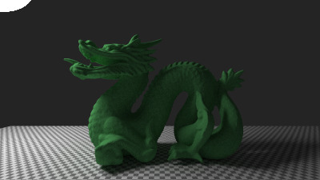

# Bubbles Renderer

Simple ray trace renderer based on ["Ray Tracing in One Weekend" tutorial series](https://raytracing.github.io/). Name comes from the fact that in its first version, this renderer only supported rendering of spheres. Repo also contains dynamics simulations + infra to render sim results.

### Features

* Path tracing with importance sampling toward lights
* Shapes: Spheres (with motion blur), rectangles, boxes, 3D meshes (obj files)
* Materials: Lambertian, (fuzzy) metal, dielectrics (e.g. glass), isotropic (e.g. smoke), image textures
* Fluid sim with Smoothed Particle Hydrodynamics (SPH)

### Build/run
```
make # See Makefile for other options

# For rendering of hard-coded scenes
./render_to_ppm > image.ppm

# Fluids sim + rendering. Use imagemagick to create gif
./fluids_sim
convert -delay 20 -loop 0 examples/images/frame_*.ppm fluid_sim.gif
```

### Gallery




